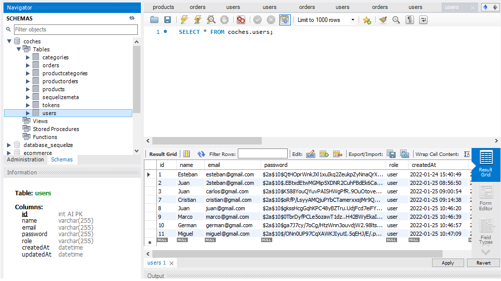

# Back-end Project
Back-end project is a simple database for a car's eccommerce created with sequelize. 

## TECHNOLOGIES 🛠️
This database was created using Javascript, Node.js, Express, mySQL, sequelize, Bcrypt and Middleware. The code was written in Visual Studio Code.

### REQUIREMENTS 📋
Visual studio code. Node.js installed. MySQL server and Workbench installed. Postman installed.

### HOW TO RUN THIS PROGRAM 🔧
## Geting Started 🚀
- Clone this repository `https://github.com/ivanpuebla10/proyectoback1`
- Install the dependencies `npm install`
- Create a new repo on GitHub: `https://github.com/new`
    - Make sure the "Initialize this repository with a README" option is left unchecked
- Update the remote to point to your GitHub repository: git remote set-url origin `https://github.com/YOUR_GITHUB_USERNAME/YOUR_REPOSITORY_NAME`

## Working on the project 👷‍♂️
* Move into the project directory: `cd ~/YOUR_PROJECTS_DIRECTORY/YOUR_PROJECT_NAME`
* Run the project with : `npm run dev`
    * Server runs at [localhost](https://localhost:4000)
    * Automatically restarts when any of your files change

Using Postman you can see what the database brings and send requests. To see what is happening with databases the program is creating open mysql workbench and explore the databases and its tables. There is an autentication implemented and there are also roles, so yo must create an user with the role "admin" to access the routes that are only available for admins.

### Previews
<!-- Users in postman:
 -->

Database's diagram(MySQL Workbench):

Database's table example:

Folders organization:

## Author ✒️
* **Ivan Puebla** - *The Bridge* - [ivanpuebla10](https://github.com/ivanpuebla10)